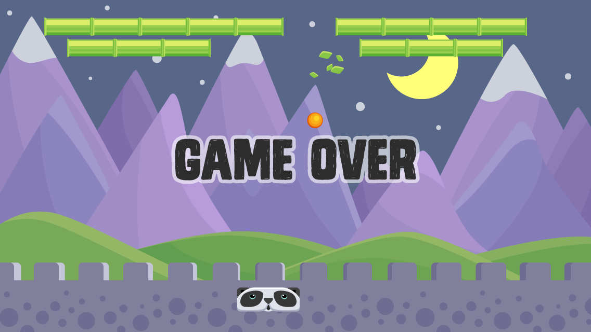

# Neural BreakOutPanda 🐣🐼

An HTML5 simulation of an Artificial Intelligence model rained to play breakout
by avoiding the ball touching the ground
in response the neural network decides to move the paddle left or right

### Craters.js Game engine
### Tensorflow.js
### Images by Gameartguppy.com
### Sound "Space fleet rejects"

Read blog post;
[https://www.swana.me/2020/01/training-tfjs-model-on-breakout.html](https://www.swana.me/2020/01/training-tfjs-model-on-breakout.html)
